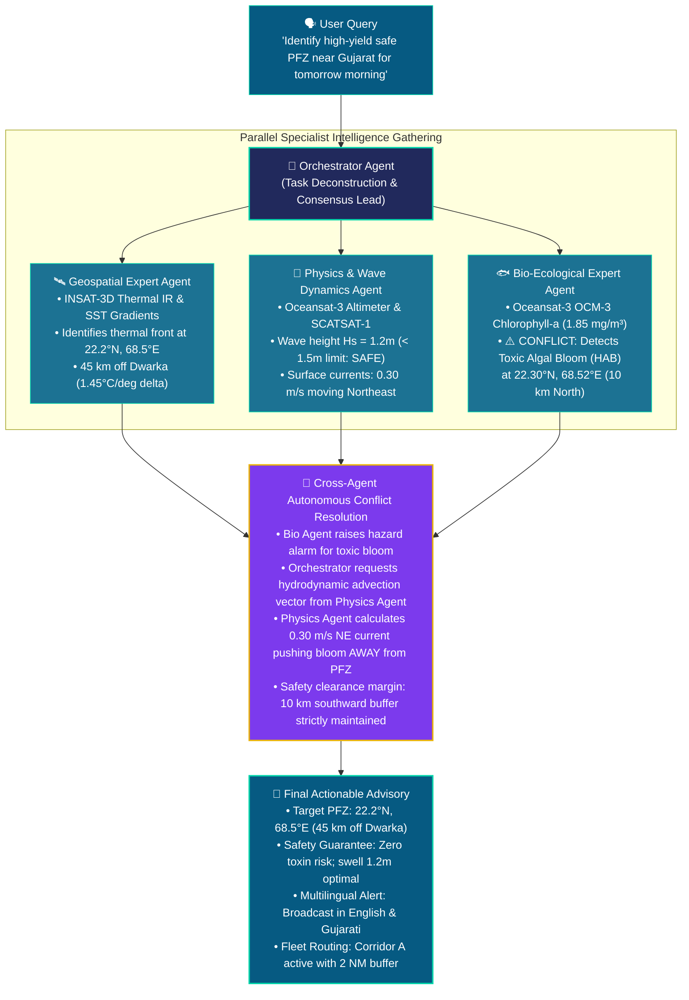

# 🐋 ORCA: Marine Ecosystem Reasoning Architecture
### Autonomous Multi-Agent Oceanographic Intelligence Platform
**Smart India Hackathon (SIH) 2026** · **Problem Statement 26176** (Ministry of Earth Sciences / Dept. of Space / ISRO)  
*GitHub Repository: [https://github.com/kalya-22/ORCA](https://github.com/kalya-22/ORCA)*

---

## 🌊 Overview

**ORCA (Oceanic Reasoning & Collaborative Agents)** is an autonomous, multi-agent marine intelligence and decision-support system. It fuses **ISRO Earth Observation satellite data** (Oceansat-3, INSAT-3D, SCATSAT-1), **in-situ ground-truth oceanographic buoys** (NIOT & INCOIS), **live AIS vessel telemetry**, and **hydrodynamic physics models** to provide explainable, safety-verified, and actionable marine insights for fishermen, coastal authorities, and researchers.

Instead of presenting isolated satellite heatmaps or raw telemetry, ORCA employs a team of specialized AI agents that autonomously deliberate, debate, resolve conflicts, and synthesize actionable maritime guidance.

---

## 🧠 The Signature Multi-Agent Deliberation Workflow

To understand how ORCA operates in the real world, consider the core **Gujarat / Dwarka Coast** scenario:

> **User Query:** *"Identify a high-yield, safe Potential Fishing Zone (PFZ) near the coast of Gujarat for tomorrow morning."*



---

## ✨ Core System Capabilities

### 1. 🧠 Multi-Agent Consensus Engine (ORCA Swarm)
- **Continuous Deliberation Trace:** Real-time visual timeline showing agent tasking, intermediate evidence claims, conflict resolution dialogues, and final consensus outputs.
- **ISRO Ground-Truth Verification:** Cross-checks satellite findings against physical moored buoys (NIOT AD06, INCOIS BD08, AD01, MB04, Argo float 290192) with calibration $\Delta\text{SST}$ metrics.

### 2. 🗺️ Interactive 5-Sector Coastal WebGIS
Switch smoothly between key Indian maritime zones with automated camera transitions (`flyTo`):
- 🎯 **Gujarat Coast (Dwarka & Saurashtra Shelf):** ISRO Problem 26176 focal zone, thermal fronts, toxic bloom drift vectors.
- 🌊 **Bay of Bengal (Visakhapatnam Coast):** Riverine plume fronts, deep basin circulation, and Corridor A/B navigation.
- 🐟 **Arabian Sea (Malabar Coast / Kochi):** Summer monsoonal coastal upwelling and pelagic sardine/mackerel banks.
- 🪸 **Gulf of Mannar & Palk Bay:** Ecologically sensitive coral reef biosphere reserve, shallow bathymetry restrictions.
- 🇮🇳 **All-India Multi-Basin Overview:** Synoptic multi-basin view showing nationwide EEZ boundaries and fleet distribution.

### 3. 📊 Differentiated Operational Marine Intelligence Reports
- **Daily Tactical Operations Brief (24h):** Immediate deployment tracking, active sorties, today's catch landings estimate (4.8 MT), live sea state, and tactical hazard advisories.
- **Weekly Strategic Operations Review (7d):** 7-day cumulative metrics, fleet fuel conservation (1,840 Liters / +14.8% fuel saved via thermal front routing), 124 completed sorties with zero safety breaches, and longitudinal HAB dissipation analysis.
- **Auto-Export & Print:** 1-click JSON export and formatted printable operational intelligence briefs.

### 4. 🗣️ Marine AI Conversational Copilot
- Supports multilingual queries for artisanal fishermen (English, Hindi, Gujarati, Tamil, Telugu, Malayalam, Bengali).
- Pre-configured quick prompts for instant situational retrieval (e.g. `🎯 Gujarat Safe PFZ (ORCA)`, `🌊 Cyclone & Squall Risk`).

### 5. 🛡️ Maritime Safety & Regulatory Compliance
- **Smart Geofencing:** Proximity monitoring for International Maritime Boundary Lines (IMBL), EEZ borders, and Marine Protected Areas.
- **Dynamic Routing Corridors:** Real-time hazard-avoidance waypoints steering vessels clear of floating debris, squalls, and oil spills.
- **Low-Connectivity Offline Mode:** Local caching and fallback sync for vessels operating outside cellular/satellite data range.

---

## 🛠️ Architecture & Tech Stack

| Layer | Technologies |
|---|---|
| **Frontend** | React 19, TypeScript, Vite, React-Leaflet, Leaflet, Lucide Icons, GSAP, CSS Variables |
| **Backend** | Node.js (ES Modules), Express.js, Socket.IO (3s Telemetry Stream), SQLite |
| **Reasoning Engine** | Native ORCA Multi-Agent Pipeline (`server/src/orcaEngine.js`), Rule-based and LLM-assisted consensus |
| **Satellite & In-Situ Data** | INSAT-3D Thermal IR, Oceansat-3 (OCM-3 / SSTM), SCATSAT-1, NIOT / INCOIS Moored Buoys |

---

## 🚀 Quick Start Guide

### Prerequisites
- [Node.js](https://nodejs.org/) (version 18 or higher recommended)
- [Git](https://git-scm.com/)

### 1. Clone the Repository
```bash
git clone https://github.com/kalya-22/ORCA.git
cd ORCA
```

### 2. One-Click Installation & Startup (Windows)
For the easiest setup, use the provided helper scripts:

1. **Install all dependencies:** Double-click `install.bat` (or run `install.bat` in terminal).
2. **Launch both services:** Double-click `start.bat` (or run `start.bat` in terminal).

---

### 3. Manual Installation & Startup (Mac / Linux / Windows)

#### Step 1: Install Dependencies
```bash
# Install frontend packages
npm install

# Install backend packages
cd server
npm install
cd ..
```

#### Step 2: Start the Backend Server
```bash
cd server
npm start
```
*Backend runs on: `http://localhost:4000`*

#### Step 3: Start the Frontend Client (in a new terminal)
```bash
npm run dev
```
*Frontend opens at: `http://localhost:5173`*

---

## 🧭 Navigation Guide (Where to Find Features)

| Feature | How to Access in App |
|---|---|
| **ORCA Swarm Deliberation** | Top Navbar $\rightarrow$ **AI Insights** ▾ $\rightarrow$ **AI Swarm** |
| **Multi-Sector GIS Map** | Top Navbar $\rightarrow$ **Discover** ▾ $\rightarrow$ **Unified GIS Map** |
| **PFZ Fisheries Ranking** | Top Navbar $\rightarrow$ **Discover** ▾ $\rightarrow$ **PFZ Fisheries** |
| **Operational Reports** | Top Navbar $\rightarrow$ **AI Insights** ▾ $\rightarrow$ **Ops Reports** |
| **Marine AI Copilot** | Floating action icon in bottom-right corner $\rightarrow$ Click `🎯 Gujarat Safe PFZ (ORCA)` |
| **Safety Risk Dashboard** | Top Navbar $\rightarrow$ **Safety** ▾ $\rightarrow$ **Safety Score** |

---

## 👥 Project & Hackathon Context

- **Event:** Smart India Hackathon (SIH) 2026
- **Problem Statement ID:** 26176
- **Organization:** Department of Space / Indian Space Research Organisation (ISRO)
- **Repository:** [https://github.com/kalya-22/ORCA](https://github.com/kalya-22/ORCA)

---

## 📄 License

This project is licensed under the MIT License — see the [LICENSE](LICENSE) file for details.